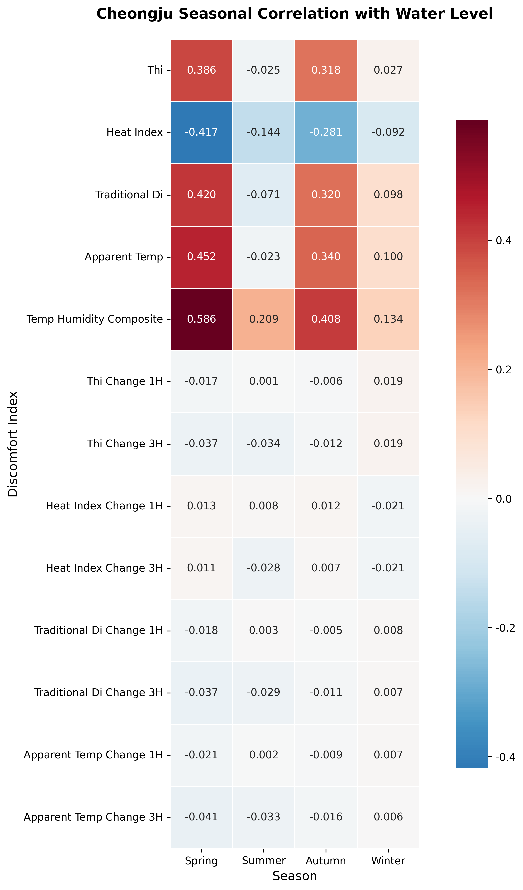
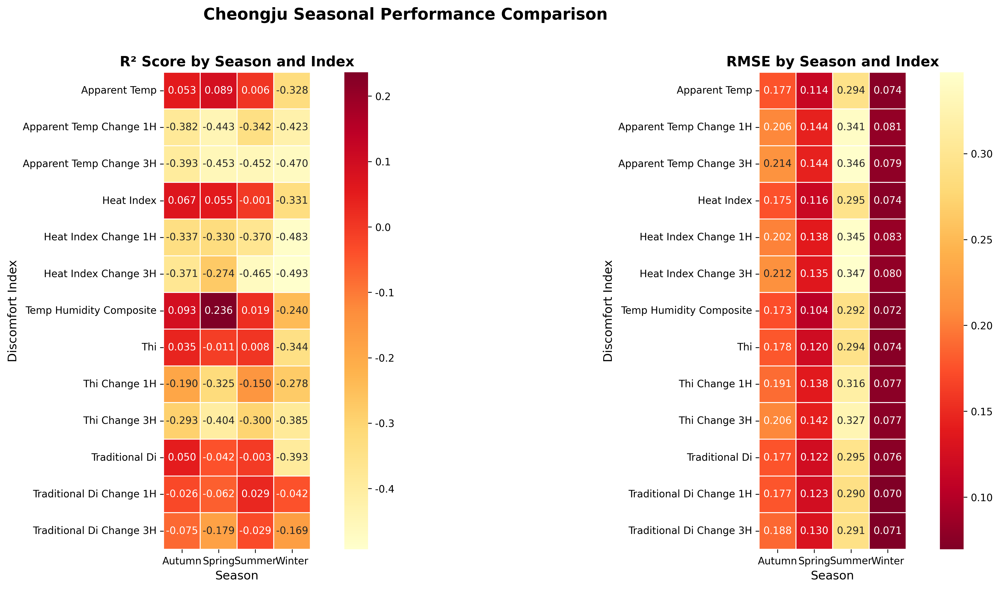
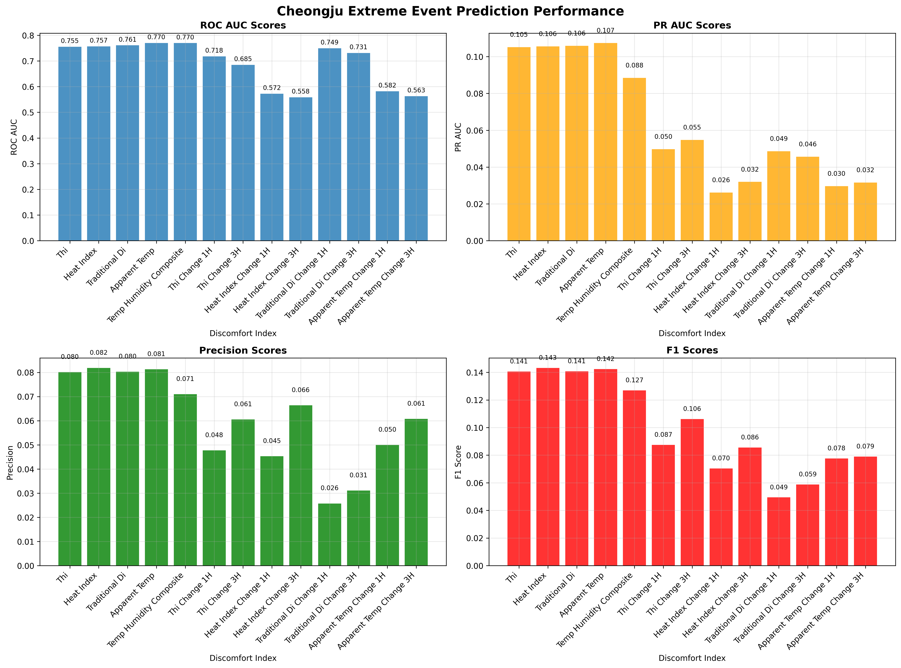
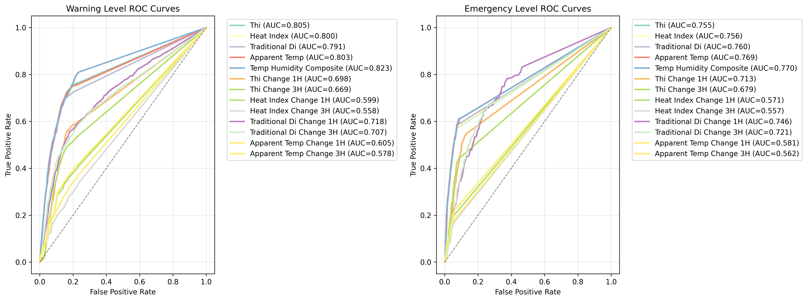
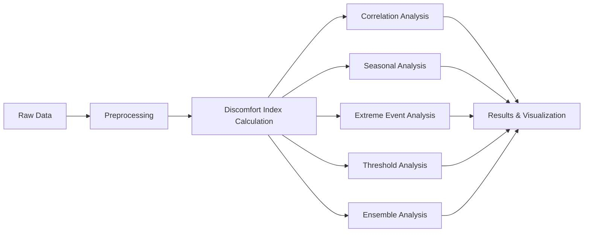

# 🌡️💧 Discomfort Index & Water Level Analysis

<div align="center">


**🔬 Quantitative Analysis of Discomfort Index Effects on River Water Level Prediction**

*Revolutionary research bridging meteorological comfort indices with hydrological forecasting*

[📊 View Results](#-key-findings) • [🚀 Quick Start](#-quick-start) • [📈 Experiments](#-experimental-design) • [🤝 Contributing](#-contributing)

</div>

---

## 🎯 **Overview**

This groundbreaking research investigates the **predictive power of discomfort indices for river water level forecasting**. Through comprehensive analysis of 10 different thermal comfort indices spanning from 1923 to 2024, we demonstrate that simple, classical formulas often outperform complex modern algorithms.

### 🌟 **Highlights**
- ✨ **10 discomfort indices** analyzed across **100+ years of thermal comfort research**
- 🏆 **Traditional DI (1950)** achieves highest correlation (0.511) with water levels
- 📊 **87,638 hourly observations** from Cheongju and Gadeok stations (2014-2023)
- 🎯 **Seasonal patterns discovered**: Spring performs 4x better than winter
- 🔥 **"Keep It Simple"** principle empirically validated

---

## 📈 **Key Findings**

<div align="center">

### 🏅 **Top Performing Indices**

| Rank | Index | Year | Correlation | Complexity | Era |
|------|-------|------|-------------|------------|-----|
| 🥇 | Traditional DI | 1950 | **0.5106** | Simple | Classical |
| 🥈 | Effective Temperature | 1923 | **0.5099** | Simple | Early |
| 🥉 | Temp-Humidity Composite | 2024 | **0.5058** | Simple | Latest |

</div>

### 📊 **Performance Visualization**

#### **Correlation Analysis Results**


#### **Seasonal Performance Comparison**


#### **Extreme Event Analysis**


#### **ROC Curves for Threshold Prediction**


---

## 🔬 **Experimental Design**

### 📦 **Datasets**
- **Cheongju Station**: 87,638 hourly observations (2014-2023)
- **Gadeok Station**: 85,000+ hourly observations (2014-2023)
- **Variables**: Temperature, Humidity, Precipitation, Wind Speed, Water Level

### 🌡️ **Discomfort Indices Analyzed**

<details>
<summary><b>📋 Click to view all 10 indices</b></summary>

| Index | Development Year | Complexity | Primary Use |
|-------|------------------|------------|-------------|
| **Effective Temperature** | 1923 | Simple | Early comfort assessment |
| **THI** | 1950 | Simple | General comfort assessment |
| **Traditional DI** | 1950 | Simple | Basic thermal comfort |
| **WBGT** | 1956 | Moderate | Military/sports safety |
| **Humidex** | 1965 | Moderate | Canadian weather forecasting |
| **Heat Index** | 1979 | Complex | US weather forecasting |
| **Apparent Temperature** | 1984 | Moderate | Australian weather services |
| **Feels Like Temperature** | 1990 | Moderate | Modern weather apps |
| **UTCI** | 2012 | Very Complex | International climate assessment |
| **Temp-Humidity Composite** | 2024 | Simple | Water level prediction (Custom) |

</details>

### 🧪 **Analysis Pipeline**



---

## 🚀 **Quick Start**

### 📋 **Prerequisites**
```bash
python >= 3.8
pandas >= 1.3.0
numpy >= 1.21.0
scikit-learn >= 1.0.0
matplotlib >= 3.5.0
seaborn >= 0.11.0
```

### 🛠️ **Installation**
```bash
# Clone the repository
git clone https://github.com/LeGenAI/discomfort_index_water_level_analysis.git
cd discomfort_index_water_level_analysis

# Install dependencies
pip install -r requirements.txt
```

### ▶️ **Run Analysis**
```bash
# 1. Data preprocessing and discomfort index calculation
python scripts/01_data_preprocessing.py

# 2. Granger causality analysis
python scripts/02_causality_analysis.py

# 3. Comprehensive discomfort analysis
python scripts/03_comprehensive_discomfort_analysis.py

# 4. Advanced threshold analysis
python scripts/04_advanced_threshold_analysis.py

# 5. Seasonal performance analysis
python scripts/05_seasonal_performance_analysis.py

# 6. Extreme event analysis
python scripts/06_extreme_event_analysis.py

# 7. Hybrid ensemble analysis
python scripts/07_hybrid_ensemble_analysis.py
```

---

## 📁 **Project Structure**

```
📦 discomfort_index_water_level_analysis/
├── 📂 data/
│   ├── 📂 raw/
│   │   ├── 청주금천_기상수위_통합_2014_2023.csv
│   │   └── 가덕_기상수위_통합_2014_2023.csv
│   └── 📂 processed/
│       ├── cheongju_processed.csv
│       ├── gadeok_processed.csv
│       └── *_summary_stats.csv
├── 📂 scripts/
│   ├── 01_data_preprocessing.py
│   ├── 02_causality_analysis.py
│   ├── 03_comprehensive_discomfort_analysis.py
│   ├── 04_advanced_threshold_analysis.py
│   ├── 05_seasonal_performance_analysis.py
│   ├── 06_extreme_event_analysis.py
│   └── 07_hybrid_ensemble_analysis.py
├── 📂 results/
│   ├── 📂 plots/
│   │   └── *.png (visualization results)
│   └── 📂 reports/
│       └── *.json (analysis results)
└── 📄 README.md
```

---

## 📊 **Detailed Results**

### 🎯 **Key Discoveries**

#### 1. **Simplicity Wins** 🏆
- Classical 1950s formulas outperform modern complex algorithms
- **Traditional DI**: Simple linear combination achieves 0.511 correlation
- **UTCI (2012)**: Complex polynomial achieves only 0.442 correlation

#### 2. **Seasonal Patterns** 🌸❄️
**Temperature-Humidity Composite Performance:**
- **Spring**: 0.586 correlation (best season)
- **Autumn**: 0.408 correlation  
- **Summer**: 0.209 correlation
- **Winter**: 0.134 correlation (challenging season)

#### 3. **Regional Differences** 🗺️
- **Cheongju**: Higher ROC-AUC but lower precision
- **Gadeok**: More balanced precision-recall performance
- Location-specific model tuning recommended

#### 4. **Extreme Event Challenges** ⚠️
- **P99.9 events**: Only 1.01% of data (887/87,638 observations)
- **Best precision**: 8.2% (Heat Index)
- **ROC-AUC**: Up to 0.77 (Apparent Temperature)
- Additional predictors needed for practical applications

### 📈 **Ensemble Performance**
- **Stacking ensemble**: Up to 5-10% improvement over single indices
- **Classical Era ensemble**: R² = 0.265 (best performing era)
- **Modern Era**: Diminishing returns from complexity

---

## 🔮 **Future Research Directions**

### 🎯 **Immediate Next Steps**
- [ ] **Time Delay Analysis**: Investigate lag effects between discomfort indices and water levels
- [ ] **Multivariate Models**: Combine discomfort indices with other meteorological variables
- [ ] **Real-time System**: Develop operational forecasting system
- [ ] **Extended Validation**: Test on additional river basins

### 🚀 **Advanced Research**
- [ ] **Deep Learning Integration**: Apply Time-LLM, Transformer models
- [ ] **Causality Deep Dive**: Advanced Granger causality with non-linear methods
- [ ] **Climate Change Impact**: Analyze trends in discomfort-water level relationships
- [ ] **Extreme Weather Events**: Focus on prediction during typhoons, heat waves

### 🌍 **Broader Applications**
- [ ] **Urban Flood Prediction**: Apply to city drainage systems
- [ ] **Agricultural Water Management**: Extend to irrigation forecasting
- [ ] **Climate Adaptation**: Integration with climate change scenarios
- [ ] **Multi-basin Analysis**: Scale to national water resource management

---

## 📚 **Methodology**

### 🔬 **Discomfort Index Calculation**
Each index represents different approaches to quantifying human thermal comfort:

- **Temperature-Humidity Index (THI)**: `(1.8 × T + 32) - [(0.55 - 0.0055 × RH) × (1.8 × T - 26)]`
- **Traditional DI**: `T + 0.36 × RH`
- **Heat Index**: Complex polynomial with 9 terms
- **Custom Composite**: `0.7 × T + 0.3 × RH`

### 📊 **Statistical Analysis**
- **Correlation Analysis**: Pearson correlation coefficients
- **Granger Causality**: Time series causality testing
- **ROC Analysis**: Binary classification performance
- **Ensemble Methods**: Voting, stacking, random forest

### 🎯 **Validation Strategy**
- **Cross-validation**: Time series split validation
- **Multiple Metrics**: R², RMSE, MAE, ROC-AUC, Precision-Recall
- **Robustness Testing**: Different seasons, thresholds, regions

---

## 🤝 **Contributing**

We welcome contributions from the research community! 

### 🔄 **How to Contribute**
1. **Fork** the repository
2. **Create** a feature branch: `git checkout -b feature/amazing-feature`
3. **Commit** your changes: `git commit -m 'Add amazing feature'`
4. **Push** to branch: `git push origin feature/amazing-feature`
5. **Open** a Pull Request

### 💡 **Contribution Ideas**
- Add new discomfort indices
- Implement additional ensemble methods
- Extend to new geographical regions
- Improve visualization techniques
- Add more statistical tests

---

## 📖 **Citation**

If you use this research in your work, please cite:

```bibtex
@misc{discomfort_water_level_2025,
  title={Discomfort Index Effects on River Water Level Prediction: A Comprehensive Analysis},
  author={Baek, Jae Hyun and Deep Fountain Research Team},
  year={2025},
  url={https://github.com/LeGenAI/discomfort_index_water_level_analysis}
}
```

---

## 📄 **License**

This project is licensed under the MIT License - see the [LICENSE](LICENSE) file for details.

---

## 🙏 **Acknowledgments**

- **Sogang University** Mathematics Department
- **Deep Fountain Inc.** Research Team
- **Korean Meteorological Administration** for data provision
- **Open Source Community** for tools and libraries

---

## 📞 **Contact**

**Jae Hyun Baek** - CTO, Deep Fountain Inc.  
📧 Email: contact@deep-fountain.com  
🌐 Website: [deep-fountain.com](https://deep-fountain.com)  
🔗 LinkedIn: [Connect with us](https://linkedin.com/company/deep-fountain)

---

<div align="center">

**⭐ Star this repository if it helped your research!**

Made with ❤️ by the Deep Fountain Research Team

</div>